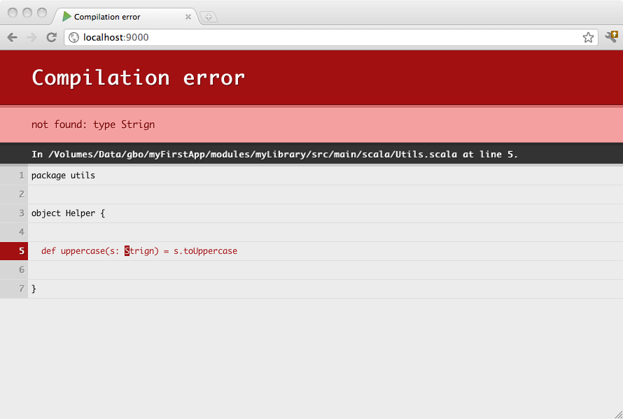

#用子项目工作

一个复杂的项目不一定是由单Play应用程序组成。你可能想要分割一个大型项目为几个小型应用程序, 或甚至提取一些逻辑到一个标准Java或Scala库，不用Play应用程序来做。

阅读[SBT文档的多项目构建](http://www.scala-sbt.org/release/docs/Getting-Started/Multi-Project)将很有用。子项目没有他们自己的构建文件, 但共享父项目的构建文件。


##Adding a simple library sub-project
You can make your application depend on a simple library project. Just add another sbt project definition in your `build.sbt` file:

```sbt
name := "my-first-application"

version := "1.0"

lazy val myFirstApplication = (project in file("."))
    .enablePlugins(PlayScala)
    .aggregate(myLibrary)
    .dependsOn(myLibrary)

lazy val myLibrary = project
```

The lowercased `project` on the last line is a Scala Macro which will use the name of the val it is being assigned to in order to determine the project’s name and folder.

The `myFirstApplication` project declares the base project. If you don’t have any sub projects, this is already implied, however when declaring sub projects, it’s usually required to declare it so that you can ensure that it aggregates (that is, runs things like compile/test etc on the sub projects when run in the base project) and depends on (that is, adds the sub projects to the main projects classpath) the sub projects.

The above example defines a sub-project in the application’s `myLibrary` folder. This sub-project is a standard sbt project, using the default layout:

```
myProject
 └ build.sbt
 └ app
 └ conf
 └ public
 └ myLibrary
   └ build.sbt
   └ src
     └ main
       └ java
       └ scala
```

`myLibrary` has its own `build.sbt` file, this is where it can declare its own settings, dependencies etc.

When you have a sub-project enabled in your build, you can focus on this project and compile, test or run it individually. Just use the `projects` command in the Play console prompt to display all projects:

```shell
[my-first-application] $ projects
[info] In file:/Volumes/Data/gbo/myFirstApp/
[info] 	 * my-first-application
[info] 	   my-library
```

The default project is the one whose variable name comes first alphabetically. You may make your main project by making its variable name aaaMain. To change the current project use the `project` command:

```shell
[my-first-application] $ project my-library
[info] Set current project to my-library
>
```

When you run your Play application in dev mode, the dependent projects are automatically recompiled, and if something cannot compile you will see the result in your browser:




##Sharing common variables and code
If you want your sub projects and root projects to share some common settings or code, then these can be placed in a Scala file in the `project` directory of the root project. For example, in `project/Common.scala` you might have:

```scala
import sbt._
import Keys._

object Common {
  val settings: Seq[Setting[_]] = Seq(
    organization := "com.example",
    version := "1.2.3-SNAPSHOT"
  )

  val fooDependency = "com.foo" %% "foo" % "2.4"
}
```

Then in each of your `build.sbt` files, you can reference anything declared in the file:

```sbt
name := "my-sub-module"

Common.settings

libraryDependencies += Common.fooDependency
```


##Splitting your web application into several parts
As a Play application is just a standard sbt project with a default configuration, it can depend on another Play application. You can make any sub module a Play application by adding the `PlayJava` or `PlayScala` plugins, depending on whether your project is a Java or Scala project, in its corresponding `build.sbt` file.

> **Note**: In order to avoid naming collision, make sure your controllers, including the Assets controller in your subprojects are using a different name space than the main project


##Splitting the route file
It’s also possible to split the route file into smaller pieces. This is a very handy feature if you want to create a robust, reusable multi-module play application

###Consider the following build configuration
`build.sbt:`

```sbt
name := "myproject"

lazy val admin = (project in file("modules/admin")).enablePlugins(PlayScala)

lazy val main = (project in file("."))
    .enablePlugins(PlayScala).dependsOn(admin).aggregate(admin)
```

`modules/admin/build.sbt`

```sbt
name := "myadmin"

libraryDependencies ++= Seq(
  "mysql" % "mysql-connector-java" % "5.1.35",
  jdbc,
  anorm
)
```

###Project structure

```
build.sbt
app
  └ controllers
  └ models
  └ views
conf
  └ application.conf
  └ routes
modules
  └ admin
    └ build.sbt
    └ conf
      └ admin.routes
    └ app
      └ controllers
      └ models
      └ views
project
  └ build.properties
  └ plugins.sbt
```

> **Note**: Configuration and route file names must be unique in the whole project structure. Particularly, there must be only one `application.conf` file and only one `routes` file. To define additional routes or configuration in sub-projects, use sub-project-specific names. For instance, the route file in `admin` is called `admin.routes`. To use a specific set of settings in development mode for a sub project, it would be even better to put these settings into the build file, e.g. `Keys.devSettings += ("play.http.router", "admin.Routes")`.

`conf/routes`:

```scala
GET /index                  controllers.Application.index()

->  /admin admin.Routes

GET     /assets/*file       controllers.Assets.at(path="/public", file)
```

`modules/admin/conf/admin.routes`:

```scala
GET /index                  controllers.admin.Application.index()

GET /assets/*file           controllers.admin.Assets.at(path="/public/lib/myadmin", file)
```

> **Note**: Resources are served from a unique classloader, and thus resource path must be relative from project classpath root.
Subprojects resources are generated in `target/web/public/main/lib/{module-name}`, so the resources are accessible from `/public/lib/{module-name}` when using `play.api.Application#resources(uri)` method, which is what the `Assets.at` method does.

###Assets and controller classes should be all defined in the `controllers.admin` package
`modules/admin/controllers/Assets.scala`:

```scala
package controllers.admin
import play.api.http.LazyHttpErrorHandler
object Assets extends controllers.AssetsBuilder(LazyHttpErrorHandler)
```

> **Note**: Java users can do something very similar i.e.:

```scala
// Assets.java
package controllers.admin;
import play.api.mvc.*;

public class Assets {
  public static Action<AnyContent> at(String path, String file) {
    return controllers.Assets.at(path, file);
  }
}
```

and a controller:

`modules/admin/controllers/Application.scala`:

```scala
package controllers.admin

import play.api._
import play.api.mvc._
import views.html._

object Application extends Controller {

  def index = Action { implicit request =>
    Ok("admin")
  }
}
```

###Reverse routing in `admin`
in case of a regular controller call:

```scala
controllers.admin.routes.Application.index
```

and for `Assets`:

```scala
controllers.admin.routes.Assets.at("...")
```

###Through the browser

```http
http://localhost:9000/index
```
triggers

```scala
controllers.Application.index
```

and

```http
http://localhost:9000/admin/index
```

triggers

```scala
controllers.admin.Application.index
```