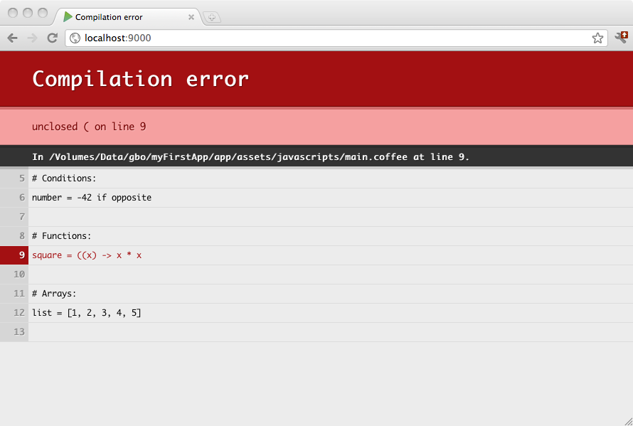

#使用 CoffeeScript

[CoffeeScript](http://coffeescript.org/) 是一种小而优雅的语言，它编译成JavaScript，为编写JavaScript代码提供一个良好的语法。

在Play中编译的资产必须定义在`app/assets` 目录。他们由构建进程处理，并且CoffeeScript 源代码会编译到标准的JavaScript文件。生成的JavaScript文件作为标准资源发布到同名的`public/` 文件夹作为其它非托管资产, 也就是说和你只编译一次再使用他们的方式没有什么不同。

例如一个CoffeeScript源文件`app/assets/javascripts/main.coffee` 可当作为一个在`public/javascripts/main.js`的标准JavaScript资源。 

CoffeeScript 源文件自动在`assets` 命令期间编译, 或当运行在开发模式时，你在浏览器刷新任何页面时编译。任何编译错误会显示到浏览器:




##布局
这里是在你的项目中使用CoffeeScript的布局示例:

```
app
 └ assets
    └ javascripts
       └ main.coffee  
```

你可以用下面的语法来在模板中使用编译后的JavaScript文件:

```html
<script src="@routes.Assets.at("javascripts/main.js")">
```


##实施和配置
当使用`PlayJava` 或`PlayScala` 插件时，CoffeeScript 编译可通过简单添加插件到你的 plugins.sbt 文件来启用：

```scala
addSbtPlugin("com.typesafe.sbt" % "sbt-coffeescript" % "1.0.0")
```

插件的默认配置通常足够了。请参阅[插件的文档](https://github.com/sbt/sbt-coffeescript#sbt-coffeescript) 了解更多配置的信息。