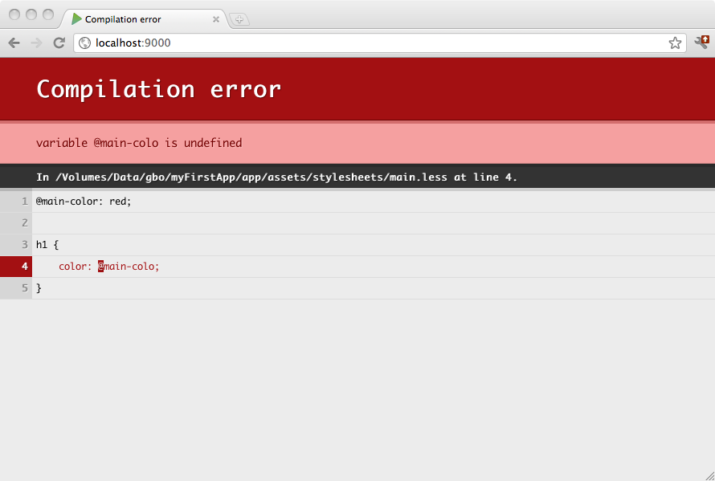

#使用 LESS CSS

[LESS CSS](http://lesscss.org/) 是一个动态的样式表语言。它允许在编写CSS文件时相当的灵活性，包括支持变量, 混合等等。

在Play编译的资产必须定义在`app/assets` 目录。他们由构建进程处理, 并且LESS源文件会编译为标准的CSS文件。生成的CSS文件作为标准资源发布到同名的`public/` 文件夹作为其它非托管资产,也就是说和你只编译一次再使用他们的方式没有什么不同。

例如,一个LESS源文件`app/assets/stylesheets/main.less` 可当做在`public/stylesheets/main.css`的标准CSS资源。Play 会自动编译`main.less` 。其它LESS 文件需要包括到你的`build.sbt` 文件中:

```sbt
includeFilter in (Assets, LessKeys.less) := "foo.less" | "bar.less"
```

LESS 源文件自动在`assets` 命令期间编译, 或当运行在开发模式时，你在浏览器刷新任何页面时编译。任何编译错误会显示到浏览器:




##用部分LESS源文件工作
你可以分割你的LESS源文件到几个库并使用LESS `import` 特性。

要防止库文件单独开始编译(或导入)，我们需要编译器忽略他们。要做到这一点部分源文件可以加上下划线(`_`)字符, 例如: `_myLibrary.less`。以下配置启用编译器忽略部分文件:

```sbt
includeFilter in (Assets, LessKeys.less) := "*.less"

excludeFilter in (Assets, LessKeys.less) := "_*.less"
```


##布局
这里是在项目中使用LESS的布局示例:

```
app
 └ assets
    └ stylesheets
       └ main.less
       └ utils
          └ reset.less
          └ layout.less    
```

在下面的`main.less` 源文件中:

```scala
@import "utils/reset.less";
@import "utils/layout.less";

h1 {
    color: red;
}
```

最后的CSS 文件会编译为`public/stylesheets/main.css` ，并且可以在模板中像常规资产一样使用它。

```html
<link rel="stylesheet" href="@routes.Assets.at("stylesheets/main.css")">
```


##使用 LESS 和 Bootstrap
[Bootstrap](http://getbootstrap.com/css/) 是一个和LESS一起使用的非常流行的库。

要使用Bootstrap，你可以通过添加它到你的库依赖来使用[WebJar](http://www.webjars.org/) 。例如, 在`build.sbt` 文件中:

```sbt
libraryDependencies += "org.webjars" % "bootstrap" % "3.3.4"
```

sbt-web 会自动提取 WebJars 到与你的资产目标文件相关的lib 文件夹。因此要使用Bootstrap你要相应导入如:

```scala
@import "lib/bootstrap/less/bootstrap.less";

h1 {
  color: @font-size-h1;
}
```


##实施和配置
当使用`PlayJava` 或`PlayScala` 插件时，可以简单添加插件到你的plugins.sbt文件来启用 LESS 编译:

```scala
addSbtPlugin("com.typesafe.sbt" % "sbt-less" % "1.0.6")
```

插件的默认配置通常足够了。请参阅[插件的文档](https://github.com/sbt/sbt-less#sbt-less) 了解更多配置信息。