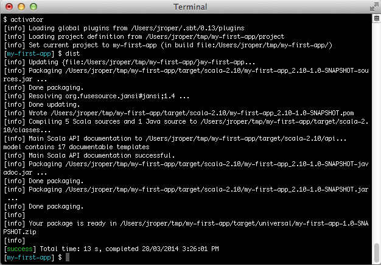
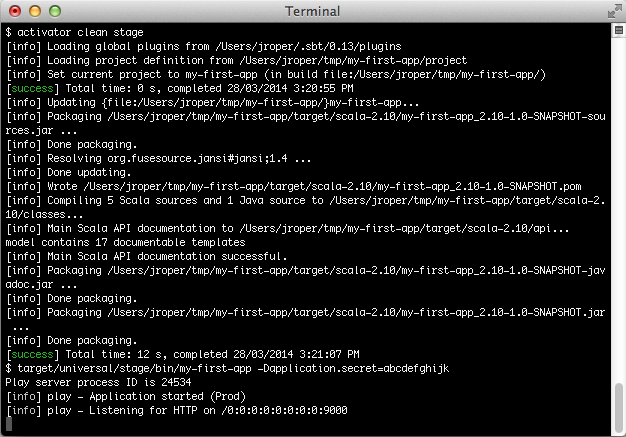

#部署你的应用程序

我们已经看到如何在开发模式运行一个Play应用程序, 但是`run` 命令不能用来在生产模式运行应用程序。当使用`run`, 在每个请求, Play 都用 sbt 检查，看是否有任何文件更改, 而这可能会明显影响应用程序性能。

有几种方式可以部署Play应用程序到生产模式。让我们使用推荐方式开始, 创建一个可发行的产品。


##应用程序secret
在运行你的应用程序到生产模式之前, 你需要生成一个应用程序secret。要了解更多这方面的信息，参阅[配置应用程序secret](../03_Configuration/02_Configuring_the_application_secret.md)。 在下面的例子, 你看到的是使用`-Dapplication.secret=abcdefghijk`。你必须生成自己的secret来使用这个。


##使用 dist 任务
dist 任务构建一个应用程序的二进制版本，你可以部署到服务器，而无须任何对sbt或activator的依赖, 服务器唯一需要的是安装好Java。

在Play控制台, 简单地键入`dist`:

```shell
[my-first-app] $ dist
```



这会在你的应用程序的`target/universal` 文件夹产生一个 ZIP 文件，包含运行应用程序需要的所有JAR文件。

要运行应用程序, 解压这个文件到目标服务器, 然后运在`bin`目录中的脚本。脚本的名称是你的应用程序的名称, 并且他自带二个版本, 一个 bash shell 脚本, 和一个windows `.bat` 脚本。

```shell
$ unzip my-first-app-1.0.zip
$ my-first-app-1.0/bin/my-first-app -Dplay.crypto.secret=abcdefghijk
```

你也可以从命令行，为一个生产环境指定不同的配置文件:

```shell
$ my-first-app-1.0/bin/my-first-app -Dconfig.file=/full/path/to/conf/application-prod.conf
```

要了解用法的说明，调用启动脚本并加上`-h` 选项。

> 对于 Unix 用户, zip 文件不持有 Unix 文件权限，所以解压后，还需要给启动脚本设置可执行权限:
>
>```
$ chmod +x /path/to/bin/<project-name>
>```
>
或者可以生成 tar.gz 文件。 Tar 文件持有权限。调用`universal:packageZipTarball` 任务而不是`dist` 任务即可:
>
`activator universal:packageZipTarball`

默认情况下, `dist` 任务在生成的包中包括 API文档。如果这是不必要的, 在`build.sbt`中添加这些行:

```sbt
sources in (Compile, doc) := Seq.empty

publishArtifact in (Compile, packageDoc) := false
```

对于构建子项目, 上述的语句也应用到所有子项目的定义。


##原生包
Play 使用[SBT 原生包插件](http://www.scala-sbt.org/sbt-native-packager/)。原生包插件声明`dist` 任务以创建一个zip文件。直接调用`dist` 任务等同于调用下面的命令:

```shell
[my-first-app] $ universal:packageBin
```

可以生成许多类型的压缩包，包括:

* tar.gz
* OS X disk images
* Microsoft Installer (MSI)
* RPMs
* Debian 包
* 在 RPM/Debian包中的 System V / init.d 和 Upstart services 

请参阅原生包插件[文档](http://www.scala-sbt.org/sbt-native-packager) 以了解更多信息。

###构建服务器发布
 sbt原生包插件提供了一些archetypes。Play默认使用的一个叫Java server archetype, 它启用了以下特性:

* System V 或 Upstart 启动脚本
* [默认文件夹](http://www.scala-sbt.org/sbt-native-packager/archetypes/java_server/my-first-project.html#default-mappings)

可以在这里找到完整的[文档](http://www.scala-sbt.org/sbt-native-packager/archetypes/java_server/index.html)。

####最小化 Debian 设置
添加以下设置到你的构建:

```scala
lazy val root = (project in file("."))
  .enablePlugins(PlayScala, DebianPlugin)

maintainer in Linux := "First Lastname <first.last@example.com>"

packageSummary in Linux := "My custom package summary"

packageDescription := "My longer package description"
```

然后用这个打包:

```shell
[my-first-app] $ debian:packageBin
```

####最小化 RPM 设置
添加以下设置到你的构建:

```scala
lazy val root = (project in file("."))
  .enablePlugins(PlayScala, RpmPlugin)

maintainer in Linux := "First Lastname <first.last@example.com>"

packageSummary in Linux := "My custom package summary"

packageDescription := "My longer package description"

rpmRelease := "1"

rpmVendor := "example.com"

rpmUrl := Some("http://github.com/example/server")

rpmLicense := Some("Apache v2")
```

然后用这个打包:

```shell
[my-first-app] $ rpm:packageBin
```

> 会出现一些错误日志。这是因为rpm 日志到 stderr 而不是 stdout。

###包含额外文件到你的发布版本
任何包含在项目的`dist` 目录中的东西，也会通过原生包包含在发布构建中。注意在Play, `dist` 目录等同于`src/universal` 目录，在原生包自己的文档中有讲到。


##Play PID 配置
Play 管理它自己的PID, 在[生产配置](https://playframework.com/documentation/2.4.x/ProductionConfiguration)会描述。为了告诉启动脚本将PID文件放到哪里，在`dist/conf` 文件夹 内的`application.ini` 文件中添加以下内容:

```shell
-Dpidfile.path=/var/run/${{app_name}}/play.pid
# Add all other startup settings here, too
```

要了解完整内容请仔细查阅 [自定义 java server 文档](http://www.scala-sbt.org/sbt-native-packager/archetypes/java_server/customize.html) 和 [自定义 java app 文档](http://www.scala-sbt.org/sbt-native-packager/archetypes/java_app/customize.html)。


##发布到 Maven (或 Ivy) 仓库
你也可以发布你的应用程序到一个 Maven仓库。这个发布的JAR文件包含你的应用程序和相应的POM文件。

你必须在`build.sbt` 文件中配置你想要发布到的仓库:

```scala
publishTo := Some(
  "My resolver" at "https://mycompany.com/repo"
)

credentials += Credentials(
  "Repo", "https://mycompany.com/repo", "admin", "admin123"
)
```

然后在Play控制台, 使用`publish` 任务:

```shell
[my-first-app] $ publish
```

> 查阅[sbt 文档](http://www.scala-sbt.org/release/docs/index.html) 以了解更多关于解析和证书定义的信息。


##在一个地方运行生产服务器
在某些情况下, 你可能不希望创建一个完整的发布版本, 事实上，你可能想要从您的项目源目录运行您的应用程序。这需要在服务上安装sbt或activator, 并且使用`stage` 任务来完成。

```shell
$ activator clean stage
```



这个会清理并编译你的应用程序, 检索所需的依赖项并将其复制到`target/universal/stage` 目录。它也创建一个`bin/<start>` 脚本，这里`<start>` 是项目的名称。脚本运行Play服务器在Unix风格系统上，同时对于Windows也有相应的`bat` 文件。

例如要从项目文件夹启动`my-first-app` 项目的应用程序，你可以:

```shell
$ target/universal/stage/bin/my-first-app -Dplay.crypto.secret=abcdefghijk
```

你也可以从命令行，为生产环境指定一个不同的配置文件:

```shell
$ target/universal/stage/bin/my-first-app -Dconfig.file=/full/path/to/conf/application-prod.conf
```

###运行一个测试实例
Play 提供一个方便的实用工具，以便在prod模式运行测试应用程序。

> 这不是打算用于生产用途的。

要在prod模式运行一个应用程序, 运行`testProd`:

```shell
[my-first-app] $ testProd
```


##使用SBT assembly插件
虽然没有正式支持, SBT assembly 插件可用于打包和运行Play应用程序。这将产生一个jar作为输出工件, 并允许你直接使用`java` 命令执行它。

要使用这个, 添加一个依赖插件到你的`project/plugins.sbt` 文件:

```scala
addSbtPlugin("com.eed3si9n" % "sbt-assembly" % "0.11.2")
```

现在添加下面的配置到你的`build.sbt`中:

```scala
import AssemblyKeys._

assemblySettings

mainClass in assembly := Some("play.core.server.NettyServer")

fullClasspath in assembly += Attributed.blank(PlayKeys.playPackageAssets.value)
```

现在你可以通过运行`activator assembly`构建工件了, 然后运行你的应用程序:

```shell
$ java -jar target/scala-2.XX/<yourprojectname>-assembly-<version>.jar -Dplay.crypto.secret=abcdefghijk
```

当然，你需要替换为正确的项目名称, 版本和scala版本。