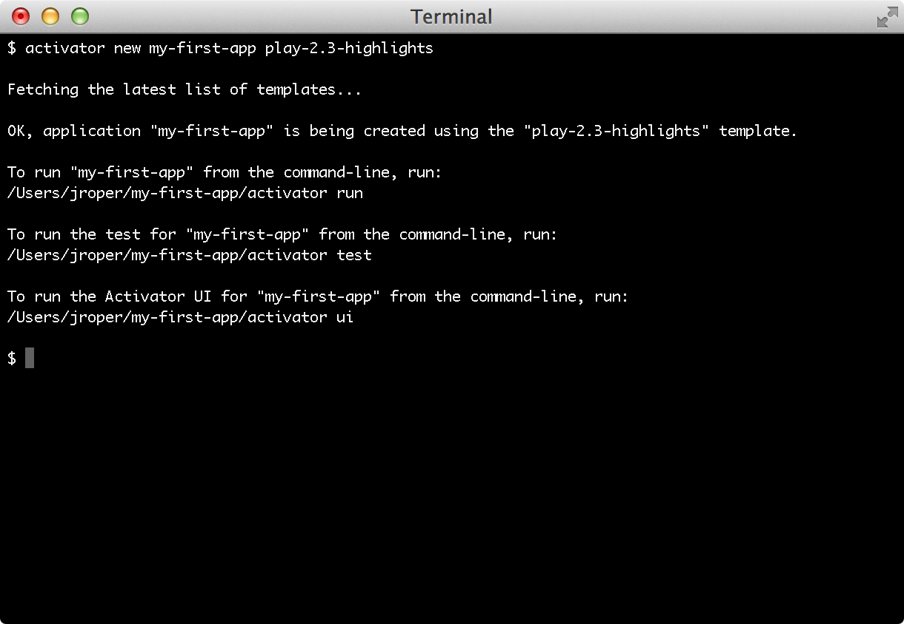

#创建一个新应用程序

##用activator命令创建一个新应用程序
`activator` 命令可用来创建一个新Play应用程序。Activator允许你选择一个模板，你的应用程序将基于这个模板创建。平常的Play项目，这些名字是`play-scala` 的模板用来创建基于Scala的Play的应用程序，同时名字是`play-java`的用来创建基于Java的Play应用程序。

> 请注意，在选择Scala或Java模板这一点上并不意味着你以后不能更改语言。举例, 只要你喜欢，你都可以使用默认的Java应用程序模板创建一个新应用程序，然后开始添加Scala代码。

要创建一个普通的Play Scala 应用程序，运行:

```shell
$ activator new my-first-app play-scala
```

要创建一个普通的Play Java 应用程序，运行:

```shell
$ activator new my-first-app play-java
```

总之，你可以用你想要的名字替换这个 `my-first-app` 。Activator 会使用这个名字做为目录名，并在里面创建程序程序。你也可以在以后更改这个名字。



> 如果你希望使用其它Activator模板, 你可以运行`activator new`。这个会提示你输入一个应用程序名, 然后让你浏览并选择一个合适的模板。

一旦应用程序被创建，你就可以再次使用`activator`命令进入[Play控制台](03_Using_the_Play_console.md)。

```shell
$ cd my-first-app
$ activator
```

##用Activator UI创建一个新应用程序
也可以使用Activator UI创建一个新Play应用程序。要使用 Activator UI, 运行：

```shell
$ activator ui
```

你可以阅读[这里](https://typesafe.com/activator/docs)的文档了解如何使用Activator UI。

##不用Activator也可以创建一个新应用程序
不用安装Activator也可以创建一个新Play应用程序, 直接使用`sbt`。

> 首先你得先安装[sbt](http://www.scala-sbt.org/)。

1.为你的应用程序创建一个新目录，然后配置你的sbt构建脚本和加上二个附加内容，在`project/plugins.sbt`中,加上:

```
// The Typesafe repository
resolvers += "Typesafe repository" at "https://repo.typesafe.com/typesafe/releases/"

// Use the Play sbt plugin for Play projects
addSbtPlugin("com.typesafe.play" % "sbt-plugin" % "2.4.x")
```

务必更换这里的 2.4.x 到你想要用的版本。如果你想要使用快照版本, 您需要额外指定这些解析器:

```
// Typesafe snapshots
resolvers += "Typesafe Snapshots" at "https://repo.typesafe.com/typesafe/snapshots/"
```

2.要使用正确的sbt版本, 确保在`project/build.properties`中有以下内容:

```scala
sbt.version=0.13.8
```

3.接着是配置`build.sbt`文件：

在Java项目的中加入:

```scala
name := "my-first-app"

version := "1.0"

lazy val root = (project in file(".")).enablePlugins(PlayJava)
```

或者在 Scala 项目中加入:

```
name := "my-first-app"

version := "1.0.0-SNAPSHOT"

lazy val root = (project in file(".")).enablePlugins(PlayScala)
```

然后在这个目录启动 sbt控制台:

```shell
$ cd my-first-app
$ sbt
```

sbt会自动获取项目需要的依赖项。