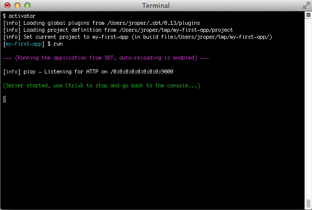

#使用Play控制台

##启动控制台
Play控制台是一个基于sbt的开发控制台，允许你在Play应用程序的整个开发周期进行管理。

要启动Play控制台, 切换到项目所在的目录, 然后运行Activator:

```shell
$ cd my-first-app
$ activator
```


##获得帮助
使用`help` 命令可以获得有关可用命令的基本帮助。你也可以在后面加上一个特定的命令名称，以获得这个命令的相关帮助信息：

```shell
[my-first-app] $ help run
```

##在开发模式下运行服务
要将当前应用程序运行在开发模式下, 使用`run`命令:

```shell
[my-first-app] $ run
```



在这个模式下, 服务器将启用自动刷新功能, 这样对于每一个请求，Play都会检查你的项目和重新编译源代码。若有需要，应用程序也会自动重启。

如果有编译错误，您将看到在浏览器中直接看到编译错误的结果:


要停止服务器, 按下 Crtl+D 键, 然后就会返回Play控制台。

##编译
在Play中你也可以无须启动服务器的情况下编译你的应用程序，只需使用`compile`命令：

```shell
[my-first-app] $ compile
```


##执行测试
正如上面的命令, 你无须启动服务器，也可以执行测试。只需使用`test`命令：

```shell
[my-first-app] $ test
```

##启动交互式控制台
输入`console`，进入交互式Scala控制台, 这里可以交互式地测试您的代码:

```shell
[my-first-app] $ console
```

要在scala控制台里面启动应用(例如访问数据库): `bash scala> new play.core.StaticApplication(new java.io.File("."))`


##调试
你可以在启动控制台时，让Play启动一个JPDA调试端口。然后你可以使用Java debugger连接调试。比如使用下面的`activator -jvm-debug <port>`命令:

```shell
$ activator -jvm-debug 9999
```

当JPDA端口可用，JVM会在应用启动时打印这行日志：

```
Listening for transport dt_socket at address: 9999
```

##使用sbt特性
Play控制台就是一个普通的sbt控制台, 所以你可以使用sbt特性，如**triggered execution**.

举例, 使用 `~ compile`:

```
[my-first-app] $ ~ compile
```

每次你更改源文件时，编译就会被触发。

如果你使用 `~ run`:

```
[my-first-app] $ ~ run
```

当开发模式服务器运行时，这个触发编译特性就会被启用。

同样你也可以用 `~ test`, 在每次你修改源文件时，不停测试你的项目:

```
[my-first-app] $ ~ test
```

##直接使用play命令
你也可以直接运行命令而无须进入Play控制台。举例, 输入`activator run`:

```
$ activator run
[info] Loading project definition from /Users/jroper/tmp/my-first-app/project
[info] Set current project to my-first-app (in build file:/Users/jroper/tmp/my-first-app/)

--- (Running the application from SBT, auto-reloading is enabled) ---

[info] play - Listening for HTTP on /0:0:0:0:0:0:0:0:9000

(Server started, use Ctrl+D to stop and go back to the console...)
```

应用程序会直接启动。当你要退出服务器，使用 `Ctrl+D`, 你会返回到操示系统终端的提示符界面。当然, **triggered execution**在这里也是可用的:

```shell
$ activator ~run
```