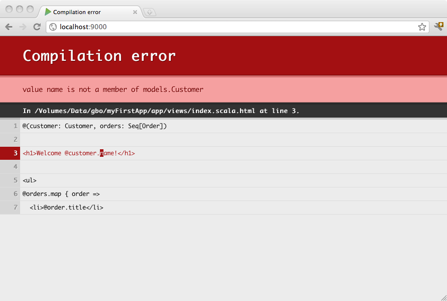

#Scala 模板语法


##基于Scala的类型安全的模板引擎
Play 自带[Twirl](https://github.com/playframework/twirl)，这是一种强大的基于Scala的模板引擎, 它的设计是受到了ASP.NET Razor的启发。具体来讲:

* **简洁, 富于表现力, 和流体**: 它最小化了文件中需要的字符数和按键数, 以及快速、流体编码的工作流。不像多数模板语法, 你无须在HTML中显式标注服务器代码块而打断代码，解析器可以聪明地从代码中自动推断。这使得模板语法简洁紧凑而富有表现力，编码干净，快速而且有趣。
* **容易学习**: 它只需学习少量概念，就让你快速提高生产力。只需要简单的Scala构念和所有你已有的HTML技能。
* **不是一门新语言**: 我们有意识地选择不去创建一门新语言，而是想让Scala开发者使用他们已有的Scala语言技能, 并提供一种有很棒的HTML构建工作流的模板语法。
* **可在任意文本编辑器中编辑**: 它不需要特殊的工具，你可以用老旧的纯文本编辑器高效使用它。

模板会被编译, 因此如果有错误，你可以在浏览器中看到:




##概述
Play Scala模板是一个包含小块Scala代码的简单文本文件。模板可以生成任何基于文本的格式, 如HTML, XML或CSV。

模板系统的设计使HTML使用者用起来很舒服, 前端开发者很容易用模板工作。

模板会编译为标准的Scala函数, 以简单的命名约定。如果你创建一个`views/Application/index.scala.html` 模板文件,它会生成一个有`apply()` 方法的`views.html.Application.index` 类。

举例，这里有一个简单的模板:

```scala
@(customer: Customer, orders: List[Order])

<h1>Welcome @customer.name!</h1>

<ul>
@for(order <- orders) {
  <li>@order.title</li>
}
</ul>
```

你可以在任意Scala代码块中调用上述代码，就像平时调用一个类的方法一样:

```scala
val content = views.html.Application.index(c, o)
```


##语法: 有魔法的 ‘@’ 字符
Scala模板只使用单个`@` 作为特殊字符。每次遇到这个字符, 就表明动态语句的开始。你无须显式关闭代码块 - 动态语句的结束位置会从代码自动推断:

```scala
Hello @customer.name!
       ^^^^^^^^^^^^^
       Dynamic code
```

因为模板引擎通过分析你的代码而自动检测代码块的结束, 所以语法只支持简单的语句。如果你想要插入复杂的语句, 要用括号显式是标注它:

```scala
Hello @(customer.firstName + customer.lastName)!
       ^^^^^^^^^^^^^^^^^^^^^^^^^^^^^^^^^^^^^^^^
                    Dynamic Code
```

你也可以使用花括号, 来同时写多条语句到一个块中:

```scala
Hello @{val name = customer.firstName + customer.lastName; name}!
       ^^^^^^^^^^^^^^^^^^^^^^^^^^^^^^^^^^^^^^^^^^^^^^^^^^^^^^^^^
                             Dynamic Code
```

因为 `@` 是一个特殊字符, 你会有时候需要转义它，通过用 `@@`:

```html
My email is bob@@example.com
```


##模板参数
一个模板就像一个函数, 因此它也需要参数, 其必须在模板文件的顶部声明:

```scala
@(customer: Customer, orders: List[Order])
```

你也可以为参数使用默认值:

```scala
@(title: String = "Home")
```

甚至可以提供几个参数组:

```scala
@(title: String)(body: Html)
```


##遍历
你可以使用`for` 关键词, 以一个漂亮的标准方式进行遍历:

```scala
<ul>
@for(p <- products) {
  <li>@p.name ($@p.price)</li>
}
</ul>
```

> **注意**: 确保`{` 和`for`在同一行，用于指明表达式还没有结束，会在下一行继续。


##If 块
If块没有什么特别的。简单使用Scala的标准`if` 语句即可:

```scala
@if(items.isEmpty) {
  <h1>Nothing to display</h1>
} else {
  <h1>@items.size items!</h1>
}
```


##声明可重用的块
你可以创建可重用的代码块:

```html
@display(product: Product) = {
  @product.name ($@product.price)
}

<ul>
@for(product <- products) {
  @display(product)
}
</ul>
```

注意你也可以声明可重用的纯代码块:

```scala
@title(text: String) = @{
  text.split(' ').map(_.capitalize).mkString(" ")
}

<h1>@title("hello world")</h1>
```

> **注意**: 声明代码块这种方式有模板中有时候是有用的，但要记住模板中不宜放复杂的逻辑。这部分代码最好放在外部的Scala类中(如果你愿意也可以放在`views/` 包下)。

按照惯例，一个可重用块的命名如果以 **implicit** 开始，那么它会标记为`implicit`:

```scala
@implicitFieldConstructor = @{ MyFieldConstructor() }
```


##声明可重用的值
你可以使用`defining` 助手方法来定义一个作用域中的值:

```scala
@defining(user.firstName + " " + user.lastName) { fullName =>
  <div>Hello @fullName</div>
}
````


##导入语句
你可以在模板（或子模板）的开始处导入任何你想要的东西:

```scala
@(customer: Customer, orders: List[Order])

@import utils._

...
```

要用绝对的解析路径，要在导入语句前使用 **root** 前缀。

```scala
@import _root_.company.product.core._
```

如果你在所有的模板中都要导入一个公共的东西, 可以在`build.sbt` 中声明：

```scala
TwirlKeys.templateImports += "org.abc.backend._"
```


##注释
你可以在模板中使用`@* *@` ，来写服务端的块注释:

```scala
@*********************
* This is a comment *
*********************@
```

你可以在模板的首行写上注释，来文档化你的模板到 Scala API doc中:

```scala
@*************************************
 * Home page.                        *
 *                                   *
 * @param msg The message to display *
 *************************************@
@(msg: String)

<h1>@msg</h1>
```


##转义
默认情况下, 动态内容部分会根据模板类型（如HTML或XML)的规则进行转义。如果你想要输出原始内容，要将它包装在模板的内容类型中。

例如输出原始 HTML:

```scala
<p>
  @Html(article.content)
</p>
```


##String interpolation
模板引擎可以用作 [string interpolator](http://docs.scala-lang.org/overviews/core/string-interpolation.html)。基本上只是将 “@” 换成 “$”:

```scala
import play.twirl.api.StringInterpolation

val name = "Martin"
val p = html"<p>Hello $name</p>"
```