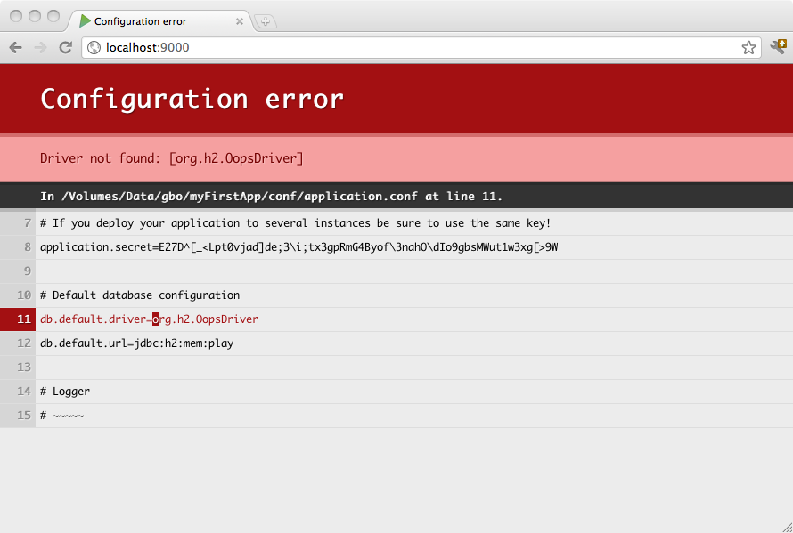

#配置和使用JDBC


##Configuring JDBC connection pools
Play提供一个管理JDBC连接池的插件，你可以按你的需求像配置许多数据库一样对它进行配置。

要启动数据库插件, 添加jdbc到你的构建依赖:

```sbt
libraryDependencies += jdbc
```

然后你必须在`conf/application.conf` 文件中配置连接池。 为了方便使用, 默认 JDBC 数据源必须叫`default` ，并且相关配置属性为 `db.default.driver` 和`db.default.url`。

如果一些属性不能正确配置你会直接在浏览器中得到通知:



> **注意**: 你最好用双引号包住JDBC URL配置的值, 因为 ‘:’ 在配置语法中为反转字符。

###H2 数据库引擎连接属性
内存数据库:

```scala
# 默认数据库配置，使用 H2 数据库引擎内存模式
db.default.driver=org.h2.Driver
db.default.url="jdbc:h2:mem:play"
```

基于文件数据库:

```scala
# 默认数据库配置，使用 H2 数据库引擎持久模式
db.default.driver=org.h2.Driver
db.default.url="jdbc:h2:/path/to/db-file"
```

关于H2数据库URLs详细信息请参阅 [H2 数据库引擎速查表](http://www.h2database.com/html/cheatSheet.html)。

###SQLite 数据库引擎连接属性

```scala
# 默认数据库配置，使用 SQLite 数据库引擎
db.default.driver=org.sqlite.JDBC
db.default.url="jdbc:sqlite:/path/to/db-file"
```

###PostgreSQL 数据库连接属性

```scala
# 默认数据配置，使用 PostgreSQL 数据库引擎
db.default.driver=org.postgresql.Driver
db.default.url="jdbc:postgresql://database.example.com/playdb"
```

###MySQL 数据库引擎连接属性

```scala
# 默认数据库配置，使用 MySQL 数据库引擎
# 以playdbuser用户身份连接到 playdb 数据库
db.default.driver=com.mysql.jdbc.Driver
db.default.url="jdbc:mysql://localhost/playdb"
db.default.username=playdbuser
db.default.password="a strong password"
```


##如何配置多个数据源

```scala
# Orders 数据库
db.orders.driver=org.h2.Driver
db.orders.url="jdbc:h2:mem:orders"

# Customers 数据库
db.customers.driver=org.h2.Driver
db.customers.url="jdbc:h2:mem:customers"
```


##配置 JDBC 驱动
Play 仅捆绑了[H2](http://www.h2database.com/)数据库驱动。因此, 要在生产中部署，你需要添加你的数据库驱动到依赖包中。

举例, 如果你使用MySQL5, 需要为连接添加 [依赖](https://www.playframework.com/documentation/2.4.x/SBTDependencies) :

```scala
libraryDependencies += "mysql" % "mysql-connector-java" % "5.1.34"
```

或者如果驱动无法从软件仓库中找到，你可以将其放到工程中的非托管目录 [unmanaged dependencies](https://www.playframework.com/documentation/2.4.x/Anatomy) `lib` 下。


##访问 JDBC 数据源
`play.api.db` 包提供了访问配置的数据源的方法:

```scala
import play.api.db._

val ds = DB.getDataSource()
```


##获取一个 JDBC 连接
有几种方式可以获取一个JDBC连接，最简单的方式为:

```scala
val connection = DB.getConnection()
```

以下代码展示一个JDBC和MySQL 5.*一起工作的简单示例:

```scala
package controllers
import play.api.Play.current
import play.api.mvc._
import play.api.db._

object Application extends Controller {

  def index = Action {
    var outString = "Number is "
    val conn = DB.getConnection()
    try {
      val stmt = conn.createStatement
      val rs = stmt.executeQuery("SELECT 9 as testkey ")
      while (rs.next()) {
        outString += rs.getString("testkey")
      }
    } finally {
      conn.close()
    }
    Ok(outString)
  }

}
```

当然你需要在打开的连接的某一点上调用 `close()` ，以返回连接池。另一个方式是让Play为你管理连接的关闭:

```scala
// 访问 "default" 数据库
DB.withConnection { conn =>
  // do whatever you need with the connection
}
```

对于其它非默认的数据库:

```scala
// access "orders" database instead of "default"
DB.withConnection("orders") { conn =>
  // do whatever you need with the connection
}
```

在代码块的结束位置，连接会自动关闭。

> **提示**: 每个和这个连接一起创建的 `Statement` 和 `ResultSet` 也会同时关闭。

变量是用来设置连接的自动提交到`false` 的，并且对代码块进行事务管理:

```scala
DB.withTransaction { conn =>
  // do whatever you need with the connection
}
```


##选择和配置连接池
Play提供两个开箱即用的数据库连接池实现, [HikariCP](https://github.com/brettwooldridge/HikariCP)  和 [BoneCP](http://jolbox.com/) . **默认是 HikariCP**, 但这个可以通过在 `play.db.pool` 属性设置来更改:

```scala
play.db.pool=bonecp
```

各种连接池的配置选项可以通过在Play的JDBC [`reference.conf`](https://www.playframework.com/documentation/2.4.x/resources/confs/play-jdbc/reference.conf)中检查`play.db.prototype`来找到。


##测试
要了解数据库测试的信息, 包括如何配置内存数据库, 参阅 [用数据库测试](../13_Testing_your_application/07_Testing_with_databases.md).


##启用 Play 数据库 evolutions
参阅 [Evolutions](https://www.playframework.com/documentation/2.4.x/Evolutions) 可以了解 Play 数据库evolutions有什么用, 按照配置说明使用它。

