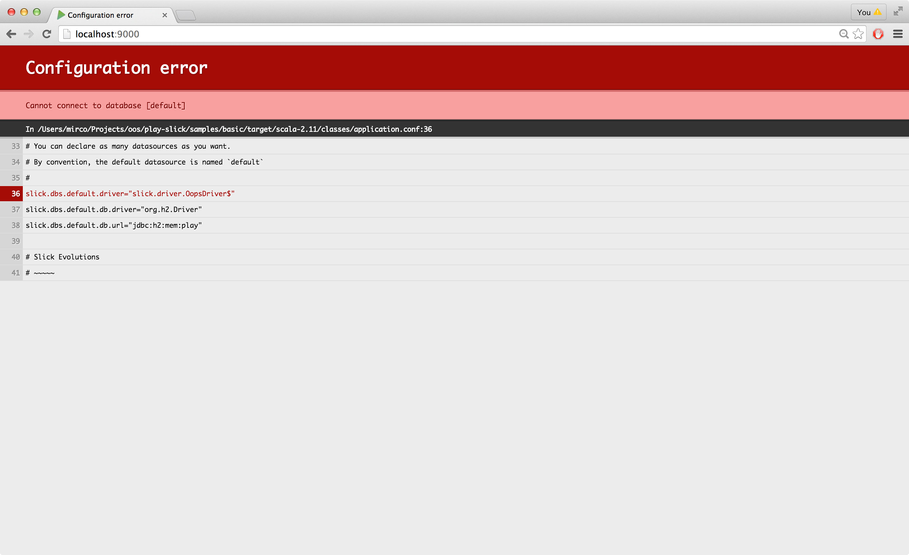

#使用 Play Slick
Play Slick 模块让 [Slick](http://slick.typesafe.com/)  成为 Play一等公民。

Play Slick 模块包含两个特性:

* 把Slick集成到Play的应用程序生命周期。
* 支持[Play 数据库 evolutions](https://www.playframework.com/documentation/2.4.x/Evolutions).

Play Slick 当前支持 Slick 3.0 和 Play 2.4, 和 Scala 2.10 至 2.11。

> 注意: 本指南假定你已经熟悉 Play 2.4 和 Slick 3.0。 此外, 还假定你会使用新的Slick 数据库 I/O Actions API。实际上, 使用被废弃的 Slick Invoker/Execution API 还是有可能的,但它已经不再被支持 - 要注意 Invoker/Execution API 在下一个Slick主要版本已经计划移除。

###获得帮助
如果你有使用Play Slick的问题, 检查 [FAQ](https://www.playframework.com/documentation/2.4.x/PlaySlickFAQ) 中有没有包含的答案。如果没有, 随时联系 [play-framework user group](https://groups.google.com/forum/#!forum/play-framework) 。同样，如果你要寻找Slick的帮助, [slick user group](https://groups.google.com/forum/#!forum/scalaquery) 将是更好的地方。

最终, 如果你想及时获得Play 和Slick 问题的答案, 和一个详细定义的SLA, 你可能会喜欢 [联系 Typesafe](http://www.typesafe.com/subscription) , 因为它提供了对这些技术的商业支持。


##关于这个释放版本
如果你已经用过Play Slick的以前版本, 你会发现有不少重大的变化。推荐阅读 [迁移指南](02_02_Play_Slick_migration_guide.md) 以平滑升级。

同时,如是你是第一次使用Play Slick, 你会看到，Slick 在 Play中的集成是十分简朴的。这意味着如果你懂Play 和Slick, 使用Play Slick模块会很直观。


##配置
添加play-slick库依赖:

```sbt
"com.typesafe.play" %% "play-slick" % "1.0.1"
```

上面的依赖也会伴随Slick库的依赖传递。这意味着你不再需要显式添加Slick的依赖。

###为支持 Play 数据库 evolutions
Play Slick 支持 [Play 数据库 evolutions](https://www.playframework.com/documentation/2.4.x/Evolutions)。

要启用 evolutions, 你需要以下依赖:

```sbt
"com.typesafe.play" %% "play-slick" % "1.0.1"
"com.typesafe.play" %% "play-slick-evolutions" % "1.0.1"
```

注意，不需要添加 Play `evolutions` 组件到你的依赖, 因为它是`play-slick-evolutions` 模块的传递依赖。

###JDBC 驱动依赖
Play Slick 模块没有绑定任何 JDBC驱动。因此, 你需要显式添加你要在应用程序中使用的 JDBC 驱动 。例如, 如果你想使用一个内存数据库，如H2, 你要添加下面的依赖:

```sbt
"com.h2database" % "h2" % "${H2_VERSION}" // 用实际版本号替换 `${H2_VERSION}` 
```


##数据库配置
要使Play Slick模块管理Slick 数据库的生命周期, 重要的一点是你不能在你的代码中显式创建数据库的实例。而是, 你应该在 **application.conf**文件中提供一个有效的Slick 驱动和数据库配置 (按照惯例，默认Slick 数据库必须叫`default`):

```scala
# 默认数据库配置
slick.dbs.default.driver="slick.driver.H2Driver$"
slick.dbs.default.db.driver="org.h2.Driver"
slick.dbs.default.db.url="jdbc:h2:mem:play"
```

首先, 注意上面这段是有效的Slick配置 (要了解你可以用来配置数据库的完整配置参数列表，查阅Slick ScalaDoc [Database.forConfig](http://slick.typesafe.com/doc/3.0.0/api/index.html#slick.jdbc.JdbcBackend$DatabaseFactoryDef@forConfig\(String,Config,Driver\)\:Database)  - 确保你在文档中展开`forConfig` 这一行)。

其次,数据库配置要在在名称前面加上 `slick.dbs` 前缀。实际上, 你可以通过重写配置键`play.slick.db.config` 的值来更改它。

第三, 在上面那段配置中`slick.dbs.default.driver` 用来配置 Slick 驱动, 而 `slick.dbs.default.db.driver` 通过Slick的后端的底层使用JDBC驱动。以上面的配置我们配置 Slick 使用 H2 数据库, 但 Slick 支持几种不同的数据库。查看 [Slick 文档](http://slick.typesafe.com/docs) 可以了解支持的数据库的完整清单以及匹配的Slick驱动。

Slick 不支持`DATABASE_URL` 环境变量以同样方式作为默认 Play JBDC 连接池。但从3.0.3版本开始, Slick 提供一个 `DatabaseUrlDataSource` ，特意为解析此环境变量。

```scala
slick.dbs.default.driver="slick.driver.PostgresDriver$"
slick.dbs.default.db.dataSourceClass = "slick.jdbc.DatabaseUrlDataSource"
slick.dbs.default.db.properties.driver = "org.postgresql.Driver"
```

在一些平台上, 如 Heroku, 你可能换为`JDBC_DATABASE_URL`, 如果它可用，会以`jdbc:vendor://host:port/db?args` 的格式。例如:

```scala
slick.dbs.default.driver="slick.driver.PostgresDriver$"
slick.dbs.default.db.driver="org.postgresql.Driver"
slick.dbs.default.db.url=${JDBC_DATABASE_URL}
```

> 注意: 不能同时为`slick.dbs.default.driver` 和`slick.dbs.default.db.driver` 提供有效值，当尝试运行你的Play应用程序时，这会导致异常。

要同时配置几种数据库:

```scala
# Orders database
slick.dbs.orders.driver="slick.driver.H2Driver$"
slick.dbs.orders.db.driver="org.h2.Driver"
slick.dbs.orders.db.url="jdbc:h2:mem:play"

# Customers database
slick.dbs.customers.driver="slick.driver.H2Driver$"
slick.dbs.customers.db.driver="org.h2.Driver"
slick.dbs.customers.db.url="jdbc:h2:mem:play"
```

如果某个地方没有正确配置, 你会在浏览器中得到通知:



> 注意: 仅在你提供有效的Slick配置时，你的应用程序才会启动。


##用法
在正确配置Slick数据库后, 你能够以两种不同方式获得一个`DatabaseConfig` (这是一个绑定数据库和驱动的 Slick 类型)。通过使用依赖注入, 或通过`DatabaseConfigProvider` 单例对象进行全局查找。

> 注意: 一个Slick 数据库实例管理一个线程池和一个连接池。一般而言, 你应该不需要在代码中显式关闭数据库 (通过调用它的`close` 方法), 因为Play Slick 模块已经会自动管理它。

###通过依赖注入获得DatabaseConfig
这里是一个如何为默认数据库注入`DatabaseConfig` 实例的示例(如数据库在配置中命名为`default` ):

```scala
class Application @Inject()(dbConfigProvider: DatabaseConfigProvider) extends Controller {
  val dbConfig = dbConfigProvider.get[JdbcProfile]
```

为不同数据库注入`DatabaseConfig` 实例也是很容易的。在前面添加一个简单的注解`@NamedDatabase("<db-name>")` 到`dbConfigProvider` 参数前面即可:

```scala
class Application2 @Inject()(@NamedDatabase("<db-name>") dbConfigProvider: DatabaseConfigProvider) extends Controller {
```

当然, 你要将字符串`"<db-name>"` 替换为你想要使用的数据库配置的名称。

要参考完整的示例, 请参阅 [示例项目](https://github.com/playframework/play-slick/tree/master/samples/di) 。

###通过全局查找获得DatabaseConfig
这里是一个如何为默认数据库查找`DatabaseConfig` 实例的示例(如数据库在配置中命名为`default` ):

```scala
val dbConfig = DatabaseConfigProvider.get[JdbcProfile](Play.current)
```

为不同数据库查找`DatabaseConfig` 实例也是很容易的。简单地通过数据库名称即可:

```scala
val dbConfig = DatabaseConfigProvider.get[JdbcProfile]("<db-name>")(Play.current)
```

当然, 你要将字符串`"<db-name>"` 替换为你想要使用的数据库配置的名称。

要参考完整的示例, 请参阅[示例项目](https://github.com/playframework/play-slick/tree/master/samples/basic)。

###在Controller中运行数据库查询
要在你的controller中运行数据库查询, 你需要Slick数据库和驱动。幸运的是, 从上面的内容我们知道如何获得Slick `DatabaseConfig`, 因此我们需要运行一个数据库查询。

你需要导入一些类和隐式驱动:

```scala
import dbConfig.driver.api._
```

然后可以定义一个控制器方法，运行一个数据库查询:

```scala
def index(name: String) = Action.async { implicit request =>
  val resultingUsers: Future[Seq[User]] = dbConfig.db.run(Users.filter(_.name === name).result)
  resultingUsers.map(users => Ok(views.html.index(users)))
}
```

这就像平常使用 Play 和 Slick一样!


##配置连接池
查阅 [这里](https://www.playframework.com/documentation/2.4.x/PlaySlickAdvancedTopics#Connection-Pool) 可以找到如何配置连接池的信息。